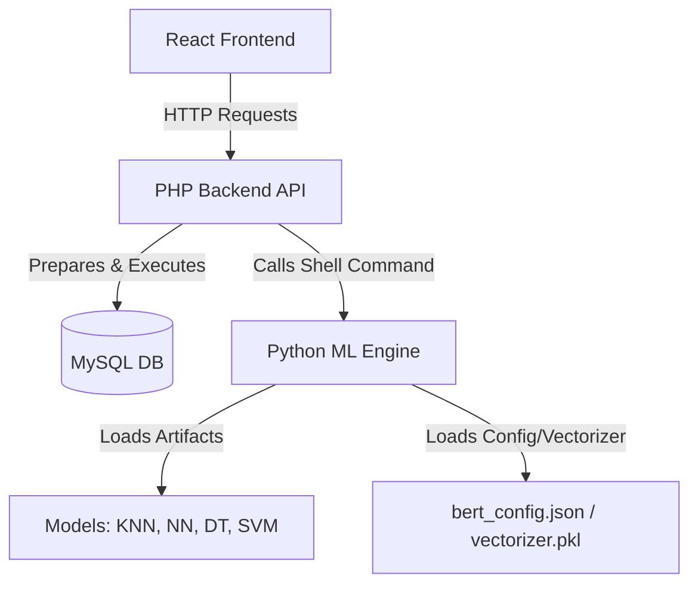

# SMS Spam Detector (SMS Shield)

Integrated system for classifying SMS spam messages using a Machine Learning backend and an interactive React web frontend.

---

## Repository Architecture



- **`frontend/`**: Vite + React SPA.
  - UI styled with CSS/Tailwind (using Lucide icons).
  - Interacts with the backend via `smsService.js`.
  - **New Features**: Real-time polling (3s), Loading animation bubbles, Asymmetric Spam Handling, Model selection dropdown, and Unblock capabilities.
- **`backend/`**: PHP micro-framework/routing API.
  - `index.php`: Directs routing (auth, messaging, spam history, conversations, unblock).
  - `bootstrap.php`: Provides database connections, requests helpers, and triggers execution of Python classifier with `--model` argument.
  - `config.php`: System settings (DB, Python binary, and model script path).
- **`database/`**: Contains database initialization scripts.
  - `schema.sql`: Sets up tables (`users`, `conversations`, `messages`, `spam_analysis`).
- **`models/`**: Machine learning sub-system supporting multiple algorithms:
  - **KNN**: Uses BERT embeddings (`best_knn_model.pkl`, `bert_config.json`).
  - **Neural Network (MLP)**: Uses Pipeline with TF-IDF (`model_TF-IDF_NeuralNetwork(MLP)_SMS_Spam.pkl`).
  - **Decision Tree & SVM**: Uses standalone TF-IDF vectorizer (`decision_tree_model.pkl`, `SVM_model.pkl`, `vectorizer.pkl`).
  - `src/predict.py`: Executed script that accepts `--model` argument to swap algorithms dynamically.

---

## Setup & Execution

### 1. Database Setup
Create database `sms_shield` and import the schema:
```bash
mysql -u root -p < database/schema.sql
```

### 2. Backend Setup
1. Configure `backend/config.php` with database credentials and Python path.
2. Spin up PHP local server:
   ```bash
   php -S 127.0.0.1:8000 -t backend
   ```

### 3. Machine Learning Setup
1. Install Python dependencies:
   ```bash
   pip install joblib transformers torch scikit-learn
   ```
2. Test classifier manually using specific models (`knn`, `nn`, `dt`, `svm`):
   ```bash
   python models/src/predict.py --model knn "Your test SMS message here"
   ```

### 4. Frontend Setup
1. Setup environment file in `frontend/.env`:
   ```env
   VITE_API_BASE=http://127.0.0.1:8000
   ```
2. Install dependencies & run development environment:
   ```bash
   cd frontend
   npm install
   npm run dev
   ```

---

## Notes 
- **DB Connection**: Shared connection handled via `db()` in [bootstrap.php](file:///c:/Users/Andi%20bayu%20hanggoro/Desktop/Sem%204/Dasildat/Website%20SMS%20spam/backend/bootstrap.php).
- **Classification Logic**: Executed in [bootstrap.php:classify_message](file:///c:/Users/Andi%20bayu%20hanggoro/Desktop/Sem%204/Dasildat/Website%20SMS%20spam/backend/bootstrap.php#L47) via CLI invoke to [predict.py](file:///c:/Users/Andi%20bayu%20hanggoro/Desktop/Sem%204/Dasildat/Website%20SMS%20spam/models/src/predict.py).
- **Asymmetric Spam**: Senders see their flagged messages normally (with a red warning icon `!`), while the recipient sees the entire conversation moved to the Spam folder.
- **Auth Flow**: Users identified on each request by `X-User-Phone` HTTP header.
